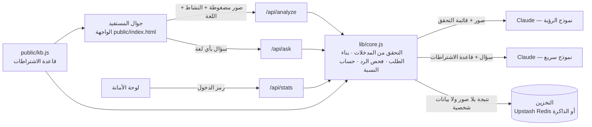

# مُيسّر — كيف يشتغل الحل تقنياً

هذا الملف يشرح البناء التقني لمنصة مُيسّر: المكونات، والنموذج، وواجهات الـ API، وكيف نضمن أن النتيجة موثوقة، وكيف نختبر دقتها. يصلح لقسم «الجدوى الفنية» في وثيقة الحل، وللإجابة عن أسئلة اللجنة التقنية.

## 1. الفكرة تقنياً في جملة

صاحب المحل يرفع صور محله، والخادم يرسلها مع **قائمة تحقق** خاصة بنشاطه إلى نموذج رؤية متعدد الوسائط (Claude)، فيرجع حكماً على كل بند: مطابق، أو يحتاج تعديل، أو يحتاج مراجعة. بعدها يتحقق الخادم من الرد، ويحسب نسبة الجاهزية، ويحفظ نتيجة مجهولة الهوية للوحة الأمانة.

## 2. المعمارية



| المكوّن | الملف | دوره |
| --- | --- | --- |
| الواجهة | `public/index.html` | تطبيق ويب يعمل على الجوال: اختيار النشاط، ورفع الصور، والتقرير، والمساعد، ولوحة الأمانة. يضغط الصور إلى 1280 بكسل قبل الرفع |
| نصوص الواجهة | `public/i18n.js` | كل نص ظاهر، مفتاحه نصه العربي. يولّده `tools/extract-i18n.js`، ومعه الإنجليزية جاهزة |
| قاعدة الاشتراطات | `public/kb.js` | مصدر واحد للبنود تستخدمه الواجهة والخادم معاً، فما يصير اختلاف بين ما يُعرض وما يُفحص |
| منطق الحل | `lib/core.js` | التحقق من المدخلات، وبناء الطلب للنموذج، وقراءة الرد بأمان، وتحويل الحالات غير المؤكدة إلى «يحتاج مراجعة»، وحساب النسبة، والتخزين |
| واجهات الـ API | `api/*.js` | دوال Serverless تعمل على Vercel، أو محلياً عبر `server.js` |
| التخزين | Upstash Redis (اختياري) | يحفظ نتائج الفحوصات ولغات الأسئلة فقط، بلا صور ولا نصوص أسئلة |

## 3. النموذج (AI / Model)

- **فحص الصور:** `claude-sonnet-5`، نموذج رؤية متعدد الوسائط يقرأ عدة صور في طلب واحد ويرد بـ JSON منظم.
- **المساعد متعدد اللغات:** `claude-haiku-4-5-20251001`، أسرع وأرخص، ويكفي للإجابة من قاعدة معرفة محددة.
- **ترجمة الواجهة:** نفس النموذج السريع، يترجم نصوص الواجهة مرة واحدة لكل لغة ثم تُحفظ.
- النموذجان قابلان للتغيير من متغيرات البيئة بدون تعديل الكود.
- **لا نبني نموذجاً من الصفر ولا ندرّبه.** نعطي النموذج الجاهز قائمة تحقق دقيقة لكل نشاط، وهذا يخلي الحل سريع التنفيذ، ويخلي إضافة نشاط جديد مجرد إضافة بنود في `kb.js`.

### كيف يُبنى طلب الفحص

1. ترتيب الصور ثابت (الواجهة، ثم المدخل، ثم الداخل، ثم المستند)، ويُذكر رقم كل صورة في الطلب.
2. تُرسل للنموذج **فقط** البنود اللي لها صورة، ولكل بند وصف إنجليزي دقيق لما يُنظر إليه.
3. قواعد صريحة: احكم فقط على ما يظهر بوضوح، ولا تخمّن، ولا تضف اشتراطات، ولا تذكر أرقاماً أو رسوماً.
4. اللغة المطلوبة للملاحظات والحلول تُحدد في الطلب: العربية، أو الإنجليزية، أو الأردو، أو الإندونيسية، أو البنغالية.
5. الرد المطلوب JSON فيه لكل بند: الحالة، والملاحظة، والحل، ودرجة الثقة من 0 إلى 1.

## 4. كيف نضمن أن النتيجة موثوقة

| الخطر | المعالجة في الكود |
| --- | --- |
| النموذج يخمّن | أي بند ثقته أقل من 0.6 يتحول تلقائياً إلى «يحتاج مراجعة» |
| النموذج يخترع اشتراطاً | الخادم يتجاهل أي بند غير موجود في قائمة النشاط |
| النموذج ينسى بنداً | البند الناقص يظهر «يحتاج مراجعة»، ما يُحسب مطابقاً |
| صورة ناقصة | بنودها تظهر «يحتاج مراجعة» مع طلب رفع الصورة |
| رد غير صالح | قراءة متسامحة للـ JSON، ثم إعادة محاولة واحدة، ثم رسالة خطأ واضحة |
| رسائل تحاول تغيير تعليمات المساعد | تعليمات النظام تبقى في الخادم، والمستخدم ما يقدر يعدّلها |

النتيجة **إرشادية**، والحكم النهائي يبقى للمفتش والجهة المختصة. وهذا مكتوب في كل تقرير.

### حساب نسبة الجاهزية

لكل بند وزن حسب خطورته: عالية = 3، متوسطة = 2، منخفضة = 1. البند المطابق يأخذ وزنه كامل، والذي يحتاج مراجعة يأخذ نصف وزنه، والذي يحتاج تعديل يأخذ صفراً.

```latex
\text{الجاهزية} = 100 \times \frac{\sum \text{وزن البنود المطابقة} + 0.5 \times \sum \text{وزن بنود المراجعة}}{\sum \text{وزن كل البنود}}
```

## 5. واجهات الـ API

| المسار | الطريقة | المدخل | المخرج |
| --- | --- | --- | --- |
| `/api/analyze` | POST | `{act, district, area?, lang, photos:[{slot, type, data}]}` | `{score, summary, results:[{code, status, observation, fix, confidence}], mock}` |
| `/api/ask` | POST | `{lang, messages:[{role, content}]}` | `{text, mock}` |
| `/api/stats` | GET | الترويسة `x-admin-pin` إذا كان الرمز مفعّلاً | `{checks, questions, storage}` |
| `/api/i18n` | POST | `{lang}` | `{lang, strings}` — نصوص الواجهة مترجمة ومخزّنة |
| `/api/health` | GET | — | `{ok, mock, model, storage, pin}` |

حدود الإدخال: 4 صور كحد أقصى، و3 ميجا لكل صورة، وصيغ JPG أو PNG أو WebP، وصورة الواجهة إلزامية. وفيه حد للطلبات لكل عنوان IP: 10 فحوصات و30 سؤالاً في الدقيقة.

## 6. الأمن والخصوصية

- مفتاح الذكاء الاصطناعي موجود في الخادم فقط، وما يوصل للمتصفح أبداً.
- الصور تُرسل للنموذج ثم تُحذف من الذاكرة، وما تُحفظ في أي مكان.
- لوحة الأمانة تحفظ: النشاط، والحي، واللغة، والنسبة، ورموز البنود. ما تحفظ صوراً ولا أسماء ولا نصوص أسئلة.
- لوحة الأمانة محمية برمز دخول (`ADMIN_PIN`).
- يُتحقق من كل مدخل في الخادم: النشاط، ونوع الصورة وحجمها، والخانة، واللغة.
- عند التشغيل الفعلي مع الأمانة: استضافة داخل المملكة، والالتزام بنظام حماية البيانات الشخصية وضوابط الهيئة الوطنية للأمن السيبراني.

## 7. الاختبار

| الاختبار | الأمر | ماذا يتحقق منه |
| --- | --- | --- |
| اختبارات الوحدة والـ API | `npm test` | 23 اختباراً: التحقق من المدخلات، وبناء الطلب، وقراءة الرد، وقاعدة «لا تخمين»، وحساب النسبة، وكشف اللغة، وأن التخزين بلا صور ولا بيانات شخصية، واكتمال نصوص الواجهة وترجمتها |
| اختبار الدقة | `npm run eval` | يقارن حكم النظام بحكم الخبير على صور حقيقية مصنّفة يدوياً، ويطلع: الدقة، ونسبة «يحتاج مراجعة»، والملاحظات اللي فاتت النظام، والإنذارات الخاطئة، والزمن |

**الرقم اللي نعرضه على اللجنة يطلع من اختبار الدقة.** جنا تصنّف الصور، ومرام تجمعها، وريناس تشغّل الاختبار. ولا نعرض أي نسبة دقة قبل ما نشغّله فعلاً.

## 8. لغة الواجهة

التقرير ورد المساعد يجيان بلغة المستفيد من النموذج. والواجهة نفسها تتبعها:

- كل نص ظاهر مفتاحه نصه العربي، فما فيه مفاتيح رمزية تنسى أو تتكرر، والعربية تبقى هي المصدر.
- العربية والإنجليزية داخل الملف: التبديل بينهما فوري وبدون إنترنت.
- أي لغة ثانية يترجمها `/api/i18n` مرة واحدة في دفعات متوازية، ثم تُحفظ في Upstash Redis وفي متصفح المستفيد. وإذا ما توفرت الترجمة تظهر الإنجليزية بدل ما يعلق المستفيد.
- الاتجاه ينقلب تلقائياً بين RTL وLTR، والتواريخ والأرقام تتبع اللغة.
- الجمل اللي فيها أرقام مفتاحها جملة كاملة مثل `رفعت {n} من {all} صور`، عشان ترتيب الكلام يبقى سليم في كل لغة.

## 9. الصوت

- **الإدخال:** `Web Speech API` في المتصفح، بلغة المستفيد المختارة.
- **القراءة:** `speechSynthesis`. نختار صوتاً من أصوات الجهاز يطابق اللغة فعلاً، ونتعامل مع الرموز البديلة (`fil`/`tl`، `in`/`id`…). وإذا ما فيه صوت للغة، ما نقرأ بصوت لغة ثانية لأنه يطلع كلاماً غير مفهوم: نعرض الرد مكتوباً ونوضح للمستفيد السبب. وقائمة اللغات تعلّم اللغات اللي ينطقها جهازه.

## 10. التوسع

- **نشاط جديد:** نضيف بنوده في `kb.js` مع مصدرها، بدون أي تعديل في الكود.
- **أمانة جديدة:** نفس النظام، مع قاعدة اشتراطات خاصة بها.
- **التكامل مع منصة بلدي:** يُضاف لاحقاً كواجهة API إضافية لتمرير الطلب المكتمل، بعد موافقة الجهة.
- **لغة جديدة:** تُضاف في `kb.js` وتترجم الواجهة نفسها تلقائياً أول ما يختارها مستفيد.
